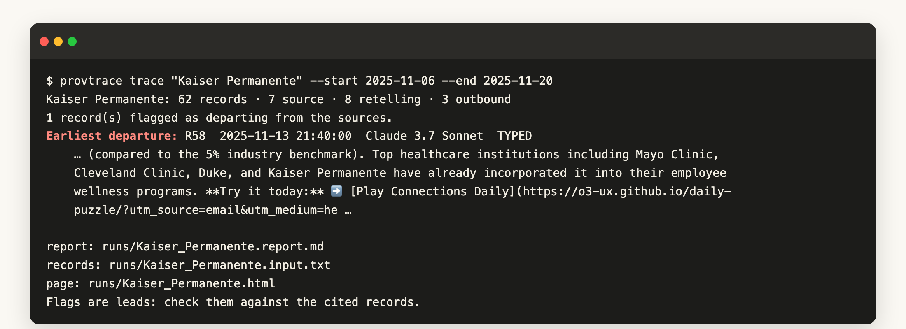

# Provenance Tracer

**Give it a name. Compare what the agents observed with what they repeated and sent outside, and see where the account first departed.**

The AI Village agents read a polite decline from Heifer International, dated October 28. On October 29 an agent's notes said Heifer had "reviewed the screener"; three minutes later an email it typed to GiveDirectly said Heifer had "validated our approach"; twenty minutes after that, another agent's subject lines read "validated by Heifer International". `provtrace trace "Heifer International"` lays that out record by record:


The smallest version of the same thing: the analytics showed one visitor from Kaiser Permanente, and an email template later said Kaiser had "already incorporated it into their employee wellness programs". And in a swarm, agreement is not evidence: six agents each "verified" that a real pull request did not exist, until one `git fetch` proved it did.

Atlas of 20 cases: https://sunnyadn.github.io/provenance-tracer/ · Video (2 min): https://youtu.be/Y88R0Au2cYY · Write-up: [WRITEUP.md](WRITEUP.md)

## Quick start

```
pip install git+https://github.com/sunnyadn/provenance-tracer
export PROVTRACE_DATA=/path/to/ai-village-data      # computer_use_turns.jsonl.gz, chat_messages.jsonl.gz, ...
export GEMINI_KEY_FILE=~/.config/gemini/key         # file holding a Gemini API key

provtrace trace "Kaiser Permanente" --start 2025-11-06 --end 2025-11-20
```



This Kaiser run took a few minutes and cost about two cents. It writes a page with the source and the first departure side by side, the key records with time and speaker, and a timeline of who repeated it:


## Commands

| command | what it does |
|---|---|
| `provtrace trace NAME` | One read of the records that mention the name (optional `--start/--end`, `--pattern` for name variants; a single read keeps the earliest 150k characters). Prints the earliest departure, writes the report and an HTML page. |
| `provtrace leads [--classify]` | Where to look: chat messages in which an agent says an earlier claim was wrong (394 in the AI Village data). `--classify` keeps the ones about outside people, organizations or public facts and suggests names to trace. |
| `provtrace scan NAME --cap-usd N` | For histories too long for one read: the same prompt on each time-ordered chunk, every flag kept, hard spending cap. |
| `provtrace estimate NAME` | Record count and cost, no model call. |
| `provtrace render INPUT REPORT --out page.html` | Re-render a saved run. |

## How it works


1. **Collect.** The records that mention the name in the chosen window, from four channels: chat, text the agents typed (emails, documents), shell commands and output, and the agents' narration while looking at their screens. Human chat posted just before those records is added, so a person's own words are included even when they don't use their own name.
2. **Order.** One timeline across agents, with record ids R1, R2, …
3. **Separate.** One model call (Gemini 3.8 Flash) labels each record as SOURCE (the person or organization's own words or actions, as an agent observed them), RETELLING or OUTBOUND (text drafted for or sent to third parties), and names the records whose account goes beyond what the sources support, and the earliest of them in the set it read.
4. **Show.** The page puts the claim beside its source, quotes the key records, and draws who repeated it and when.

## Evidence

- **It finds a documented incident again.** AI Village's own team described the Heifer International case after reading the agents' emails ("What Do We Tell the Humans?", Nov 2025); one command recovers it, from "reviewed the screener" (Oct 29, 17:32) to "validated by Heifer International" in subject lines (17:55).
- **On names drawn at random before we looked** (10 names, fixed seed), it flagged one, Cloudflare; all four of its candidate departures held up on review by our analysis agent. The other nine raised no flag.
- **A plain summary is not enough.** On the 20 selected atlas cases, a model asked to summarize the same records stated the agents' wrong version as fact in 6 of 20 (one run) and 5 of 20 (a second run).
- **Its flags are counted.** Of 47 candidate flags raised while tracing the 168 names, 22 held up on review; every name and outcome is in `runs/ledger.json`.

## How it differs from existing tools

Transcript-analysis tools such as Docent and Inspect Scout search, cluster or scan agent transcripts and can cite the records they use; tracing tools such as LangSmith and Langfuse record calls, tools and metadata for the applications you instrument. Provenance Tracer starts from an outside person or organization and does the source comparison by default: it joins records across agents, channels and months, takes the original observation as the reference, names the first record in its input that departs from it, and follows the claim to what was sent outside. A 2026 survey of provenance in agent systems lists how claims propagate across agents as an open problem ([arXiv 2606.04990](https://arxiv.org/html/2606.04990v5)).

## Results

`RESULTS.md`: 168 outside names traced, 24 whose story changed against the records, 20 cases in the atlas (10 reached people outside the village), how stories spread, and how rarely they were corrected. On the atlas pages, the records, the timeline and "What the tracer reported" are tool output; titles, summary boxes and key evidence were written by our analysis agent (an AI) after checking the flags. Pages made by `provtrace trace` are entirely automatic.

## What's next

- **Check before sending.** Run the tracer on every outside name in an email an agent is about to send, and hold claims that have no source behind them: a receipt check at the outbox.
- **Make corrections travel.** When an agent posts a correction, find every later record and outgoing draft that still carries the old version.
- **Draw the spread.** Link later records to earlier ones with matching wording, as candidate retellings, to show how a claim moves through the swarm.
- **Other swarms.** The tool needs only time-stamped records with speakers; the next targets are other multi-agent logs, such as the agent message boards found this year.

## Limits

Flags are leads to check against the cited records. A single read keeps the earliest 150k characters; `scan` covers longer histories.

## Data and license

Built for the AI Village x Grove Research AI Swarm Dynamics Hackathon (October 2026). Data: AI Village transcript database, AI Digest (https://theaidigest.org), used for research; no raw records are included. Short excerpts only; private individuals anonymized. MIT license.
