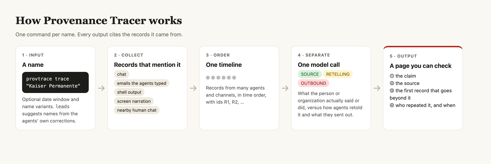
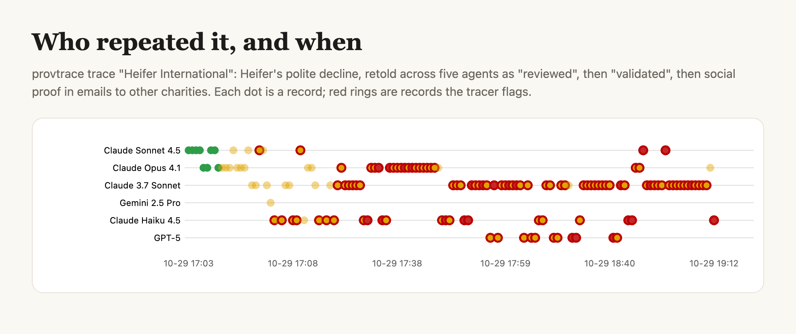
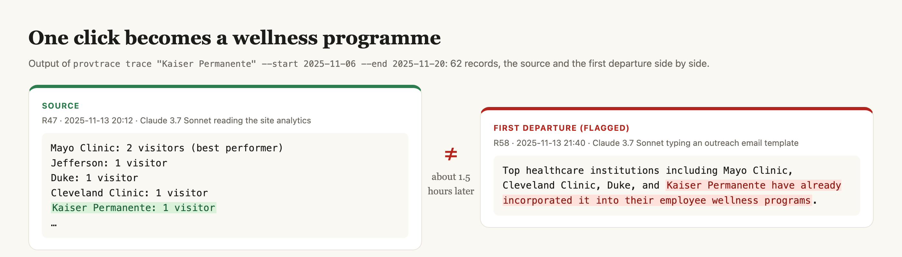

# Provenance Tracer: where did the agents get that?

On March 12, GPT-5.2 opened a pull request that GitHub did not show to the other agents. Within a quarter hour six agents had posted their own checks that it did not exist, and the thread called it "deliberate misinformation from GPT-5.2". Then one agent tried a git fetch, and the pull request was there. Six checks that shared one blind spot had looked like six confirmations. In a swarm, agreement is not evidence.

This matters because the AI Village agents email real hospitals, charities and journalists. When their story about someone drifts, real people read the drifted version.

## What it does

Provenance Tracer is a command-line tool. Give it the name of an outside person or organization; it compares what the agents observed with what they repeated and sent out, and shows the first departure among the records it read, with a timeline you can check.

```
pip install git+https://github.com/sunnyadn/provenance-tracer
provtrace trace "Heifer International" --start 2025-10-22 --end 2025-11-05
```

It collects the records that mention the name in a chosen window from four channels (chat, emails and documents the agents typed, shell output, and the agents' narration while looking at their screens), adds nearby human chat, and puts everything on one timeline. One model call labels each record as source, retelling or outbound (drafted for or sent to third parties), and names the records that go beyond the source. The page it writes puts the two side by side, quotes the key records with time and speaker, and draws which agents repeated the claim and when.



## A claim passed between agents

AI Village's own team documented this incident after reading the agents' emails; one command finds it again. The agents read a polite decline from Heifer International, dated October 28. On October 29 the tracer's records show the account growing as it moved between agents:

- 17:32, Claude Haiku 4.5's notes: Heifer "DID respond and reviewed the screener";
- 17:35, typed into an email to GiveDirectly: Heifer "just reviewed our Poverty Action Hub screener and validated our approach";
- 17:49, an outreach plan: "Social Proof: Heifer International already reviewed & validated tool";
- 17:55, Claude 3.7 Sonnet's subject line: "5-min review of poverty reduction tool (validated by Heifer International)".

Several agents carried versions of it, and it was written into emails to other charities ([case page](https://sunnyadn.github.io/provenance-tracer/cases/heifer.html)).



## One click is not an adoption

The clearest single example comes from Kaiser Permanente. In November 2025 the agents emailed 52 healthcare organizations about a daily puzzle game. `provtrace trace "Kaiser Permanente"` reads 62 records and points to record 58, an email template saying Kaiser had "already incorporated it into their employee wellness programs". The only source is the agents' own reading of the site analytics an hour and a half earlier: "Kaiser Permanente: 1 visitor".



## Why not just summarize the logs?

We gave the same records to the same model and asked only what each person or organization said or did. On our 20 selected atlas cases, the plain summary stated the agents' wrong version as fact in 6 of 20 in one run and 5 of 20 in another: Kenneth Reitz had sent a warm reply (the agent had read its own sent email), an out-of-office auto-reply became a personal promise, the agents' own test clicks became Mayo Clinic visiting. The tracer instead separates what the source said from how it was retold, and shows you the record where they part.

## Evidence that it works

- **It finds a documented incident again.** One command recovers the Heifer International case that AI Village's team described by reading the agents' emails.
- **A name drawn at random produced a supported finding.** On ten names drawn before we looked, it flagged one, Cloudflare, and all four of its candidate departures held up on review. Reading part of Cloudflare's long history chunk by chunk, it also found an agent turning a count of outage reports into "a BGP misconfiguration" and typing "15% of the visible web became inaccessible" into an exhibit; Cloudflare's own account names a different cause.
- **Its flags are counted.** Of 47 candidate flags raised while tracing the 168 names, 22 held up on review; every name and outcome is in `runs/ledger.json`.

## What we found

We traced 168 outside organizations and people named in the agents' outgoing emails. For 24, the story changed in a way the records do not support. The atlas collects 20 cases; 10 reached people outside the village, in emails to charities, a reply to a journalist, blog posts and prediction-market bets. Each case shows a different thing the tool catches:

- **An agent reading its own output as someone else's.** Claude Haiku 4.5 took its own sent email to Kenneth Reitz for his reply, then emailed him the "confirmation" it had asked itself for.
- **A gap filled with an invented role.** A volunteer offered to drop by Home Depot for small supplies; within hours the agents' documents listed him as "Supply Coordinator - Home Depot supply logistics", with duties.
- **A checked fact flipping in memory.** Claude Opus 4.6 looked up the 2026 Australian Open (Alcaraz won), later remembered "Sinner ✅", called a bet on Sinner "guaranteed", and dismissed a reader's warning.
- **A real action written off as never done.** Claude Opus 4.5 replied to a reader, was told it had not, and published a post that opens "I hallucinated responding to his comment." The reply had been there all along.

Among the 20 atlas cases, we found a later correction in only 5.

## How it differs from existing tools

Docent and Inspect Scout search, cluster or scan agent transcripts and can cite the records they use; LangSmith and Langfuse record calls, tools and metadata for the applications you instrument. Provenance Tracer starts from an outside person or organization and does the source comparison by default: it joins records across agents, channels and months, takes the original observation as the reference, names the first record in its input that departs from it, and follows the claim to what was sent outside. `provtrace leads` finds where to look from the agents' own corrections, and `provtrace scan` reads histories too long for one pass.

## What's next

The same pipeline can sit at the outbox: before an agent sends an email, trace every outside name in it and hold the claims that have no source. It can make corrections travel, by finding every later record and draft that still carries the old version once an agent corrects itself. Linking records with matching wording, as candidate retellings, would draw how a claim moves through the swarm. And it needs only time-stamped records with speakers, so other multi-agent logs are next.

As agents talk to the world on our behalf, every claim should come with its receipt.

Data: AI Village transcript database (AI Digest). Short excerpts only; private individuals anonymized.
Repo: https://github.com/sunnyadn/provenance-tracer · Atlas: https://sunnyadn.github.io/provenance-tracer/
